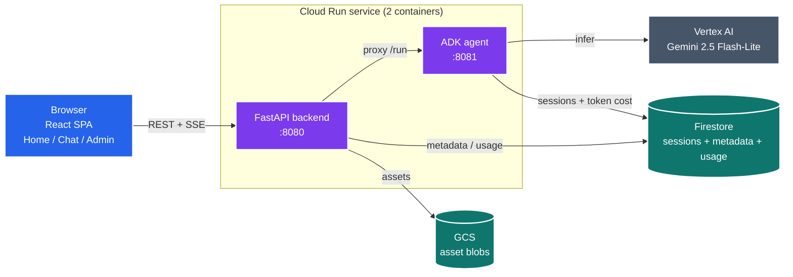
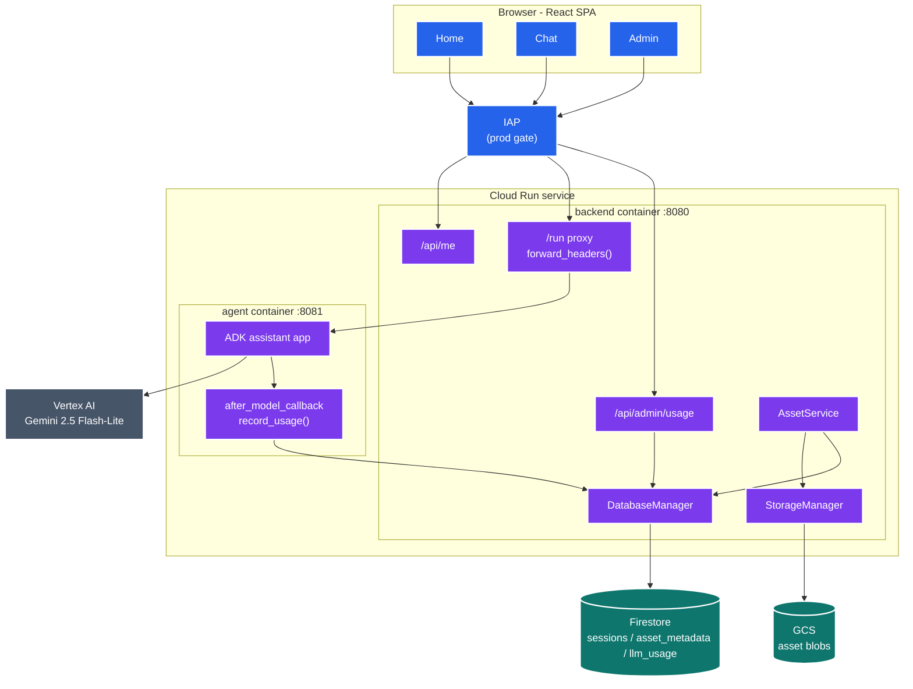
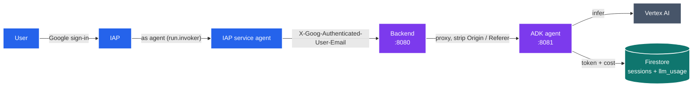
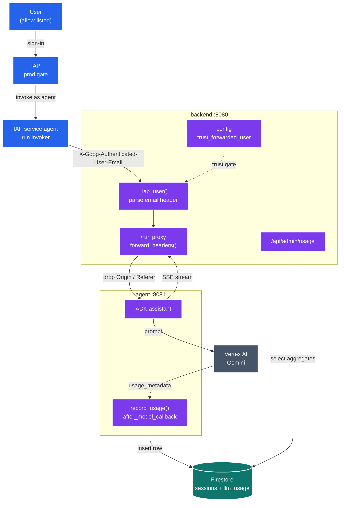
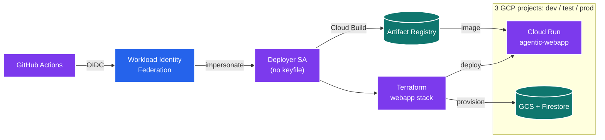
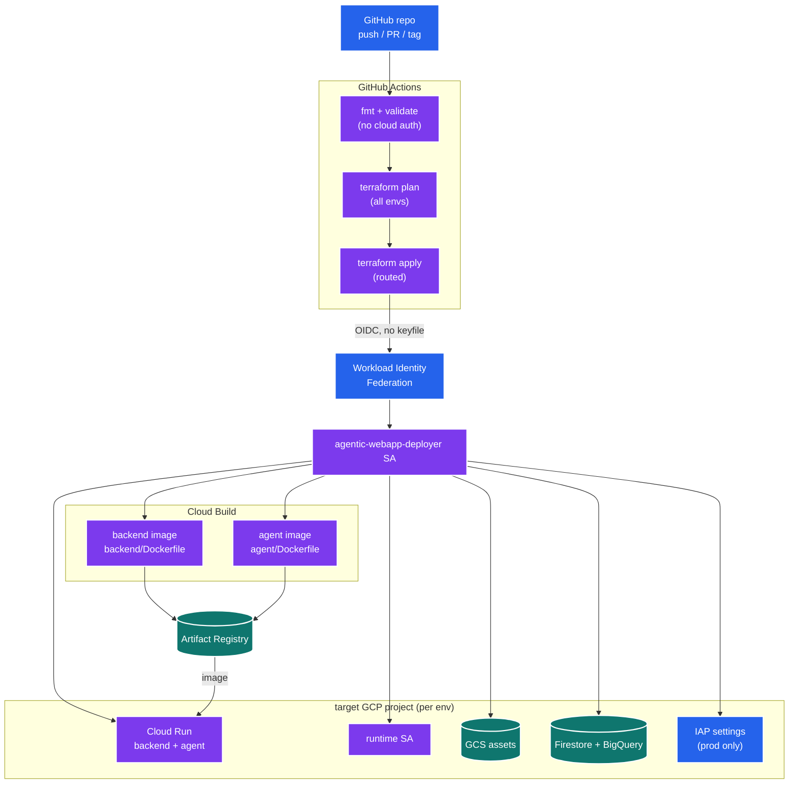
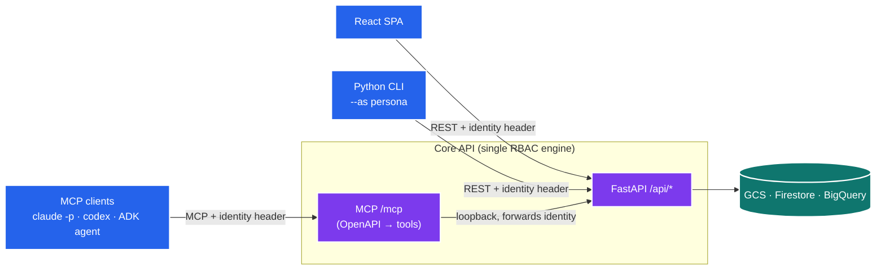

# Agentic Webapp

A scaffold for an LLM-backed web application on Google Cloud: a React SPA (Home /
Chat / Admin) served by a FastAPI backend, paired with a Google ADK agent sidecar
in a **single multi-container Cloud Run service**. Identity is enforced by
Identity-Aware Proxy (IAP); agent sessions persist to **Firestore** so a
conversation is durably resumable by its `/chat/:sessionId` URL after a cold start.
Asset metadata and per-call LLM metering (tokens + USD) also default to Firestore
(BigQuery remains a switchable backend), and uploaded asset blobs live in GCS. You can
upload a photo from the Assets page **or** attach one in chat (both write to the same
GCS-backed store); the agent has tools to look up an asset, read it (e.g. a receipt),
and record the extracted details to an analytics store — assets stay
single-source-of-truth, never duplicated into ADK's artifact store ([ADR-0006](docs/adr/adr-0006-assets-single-source-of-truth.md)).
Three isolated GCP projects provide dev / test / prod, deployed keylessly from GitHub
Actions via Workload Identity Federation.

## Deployed environments

| Env | GCP project | URL | Access |
|------|-------------|-----|--------|
| **dev** | `dbt-dev-jaffleshop` | https://agentic-webapp-67piswzbeq-ts.a.run.app | Public |
| **test** | `dbt-test-jaffleshop` | https://agentic-webapp-qfe3o66q6q-ts.a.run.app | Public |
| **prod** | `dbt-prod-jaffleshop` | https://agentic-webapp-hnqgbepo6a-ts.a.run.app | IAP (allow-listed) |

Each environment is its own project running the `agentic-webapp` Cloud Run service
in `australia-southeast1`. IAP turns on automatically in an environment when a
custom OAuth client is supplied (currently prod only) — see
[`infra/AUTH.md`](infra/AUTH.md) and [`docs/adr/adr-0002-iap-via-github-secrets.md`](docs/adr/adr-0002-iap-via-github-secrets.md).

## Architecture

Three lenses, each with an at-a-glance overview and a collapsible detailed view.

### Runtime architecture

How the application is wired at runtime: the browser SPA talks to the backend,
which proxies the agent and owns the GCS / BigQuery data plane.



*The backend serves the built SPA and is the only ingress; the agent sidecar is
reachable only at `localhost:8081` inside the service.*

<details>
<summary>Detailed runtime architecture (backend routes, managers, agent callback)</summary>



`StorageManager` and `DatabaseManager` are abstract: GCS for blobs, and Firestore
(default) or BigQuery for tabular data in the cloud, in-memory locally (selected by
`STORAGE_BACKEND` / `DATABASE_BACKEND`). Durable ADK sessions are a custom
`FirestoreSessionService` registered via ADK's service registry. The shared models
and pricing logic live in [`libs/core`](libs/core).

</details>

### Request and auth data flow

A chat message crosses two auth hops, gets proxied to the agent, and leaves a
metering side-write in BigQuery — all before the streamed reply returns.



*Two hops: IAP admits the human, then invokes Cloud Run as its own service agent.
The backend strips `Origin` / `Referer` so ADK does not 403 the proxied call.*

<details>
<summary>Detailed request and auth flow (identity parsing, bookkeeping, admin readback)</summary>



In non-prod there is no IAP, so the client sends the
`X-Goog-Authenticated-User-Email` header itself to simulate an identity — safe
because non-prod holds no sensitive data (see
[`docs/adr/adr-0004-user-identity-and-simulation.md`](docs/adr/adr-0004-user-identity-and-simulation.md)).
The code path is identical; `trust_forwarded_user` gates whether the header is
honoured.

</details>

### Deployment and CI/CD

Keyless delivery: GitHub Actions federates into a deployer SA, Cloud Build pushes
the two images to Artifact Registry, and Terraform applies the `webapp` stack into
the target project.



*No service-account keyfiles exist anywhere: GitHub's OIDC token is exchanged for
short-lived credentials that impersonate the deployer SA.*

<details>
<summary>Detailed deployment and CI/CD (env routing, image build, per-project resources)</summary>



Environment routing (in `.github/workflows/terraform-cicd-per-stack.yml`): a ready
PR applies **dev**, a push to `main` applies **test**, and a `v*` tag (gated by
GitHub Environment reviewers) applies **prod**. The WIF pool and deployer SA are
shared; the Cloud Run service, images, GCS bucket, Firestore database, BigQuery
dataset, runtime SA, and tfstate bucket are per-project.

</details>

## Interfaces to the core API

The FastAPI `/api/*` surface is the single source of functionality and the single place RBAC
is enforced (identity → roles via [ADR-0004](docs/adr/adr-0004-user-identity-and-simulation.md)
and [ADR-0007](docs/adr/adr-0007-rbac-areas-and-personas.md)). The SPA, a scriptable CLI, an
MCP server for LLM tooling, and the agent are all **interfaces** to it — none re-implements
authorization; each forwards the caller's identity and the one engine decides
([ADR-0011](docs/adr/adr-0011-core-api-mcp-and-cli.md)).



**OpenAPI** — the contract every client integrates against is live at `/openapi.json` (`/docs`
for Swagger UI); dump a copy with `make openapi`.

**CLI** — drive the API as any persona; RBAC simulation is one flag:

```bash
make -C backend dev                                                   # start the API (another shell)
uv run --directory cli -m agentic_cli personas --as ada.admin@example.com
uv run --directory cli -m agentic_cli admin users --as vera.viewer@example.com   # → 403, exit 1
```

**MCP** — the same `/api/*` operations are exposed as MCP tools at `/mcp`. Point a real LLM
harness at it as a persona (`PERSONA=ada|nina|otto|vera`); `RUN=1` executes instead of printing:

```bash
make mcp-claude PERSONA=ada  RUN=1     # claude -p over the MCP as admin
make mcp-codex  PERSONA=vera RUN=1     # codex exec — viewer is denied admin tools
make mcp-agent  PERSONA=nina           # the ADK test agent (needs Vertex/ADC)
```

Because every interface rides the one RBAC engine, the same persona yields the same allow/deny
everywhere — a viewer is refused `admin_users` identically via the CLI, the MCP, `claude -p`, and
`codex`.

The **live chat agent** is itself an MCP client: its business-logic tools are the kernel's MCP
(`assets_list` / `assets_get` / `extractions_record`), with the chat user's identity forwarded as
`X-Viewer-User-Id` per request. So the web chat doubles as an MCP+auth test surface, and recording
an extraction is now a kernel endpoint (`POST /api/extractions`) rather than sidecar logic. Only
multimodal image injection (showing the model a receipt) stays an agent callback — the generic
OpenAPI→MCP bridge can't carry image bytes ([ADR-0011](docs/adr/adr-0011-core-api-mcp-and-cli.md)).

## Project layout

| Path | Role |
|------|------|
| [`frontend/`](frontend) | React + Vite SPA (Home / Chat / Admin), built into the backend image |
| [`backend/`](backend) | FastAPI app: serves the SPA, proxies the agent, exposes `/api/*` + an MCP server at `/mcp`, owns GCS + Firestore/BigQuery |
| [`agent/`](agent) | Google ADK agent sidecar — its business-logic tools ARE the kernel's MCP (`mcp.py`), so the sidecar stays thin; meters token usage via `after_model_callback`. `agent/harness/` drives the MCP from a standalone ADK agent |
| [`cli/`](cli) | Thin Python CLI that drives `/api/*` as a chosen persona (`--as`) — RBAC simulation from the terminal |
| [`libs/core`](libs/core) | Shared models, storage / database interfaces, LLM pricing |
| [`infra/`](infra) | Terraform stacks, bootstrap (WIF), and the `tfs` deploy CLI |
| [`e2e/`](e2e) | Playwright evidence suite (chat + cost accounting) |
| [`docs/adr/`](docs/adr) | Architecture decision records |

See [`SETUP.md`](SETUP.md) for first-time setup and [`infra/AUTH.md`](infra/AUTH.md)
for the full identity model.
</content>
</invoke>
